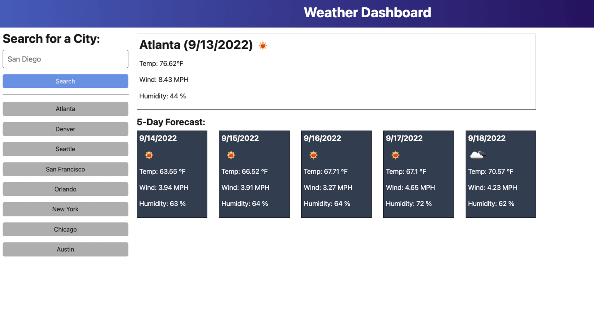

# Jasmine's Blog

## Description
For this challenge, I created a two-page website where users will input and view blog posts. It includes building a content form, dynamically rendering blog posts, and implementing a light/dark mode toggle. It isn't the prettiest, but it works. Pretty takes time and experience. I continue to preservere. 

## Front end view

## Mockup

## Technologies 
* HTML
* CSS
* Javascript

## Contact
I would appreciate any comments/suggestions you have about my project. Feel free to reach out to me at jasminejayeshjasani@gmail.com

## User Story

AS A traveler
I WANT to see the weather outlook for multiple cities
SO THAT I can plan a trip accordingly

## Acceptance Criteria
GIVEN a weather dashboard with form inputs
WHEN I search for a city
THEN I am presented with current and future conditions for that city and that city is added to the search history
WHEN I view current weather conditions for that city
THEN I am presented with the city name, the date, an icon representation of weather conditions, the temperature, the humidity, and the wind speed
WHEN I view future weather conditions for that city
THEN I am presented with a 5-day forecast that displays the date, an icon representation of weather conditions, the temperature, the wind speed, and the humidity
WHEN I click on a city in the search history
THEN I am again presented with current and future conditions for that city

